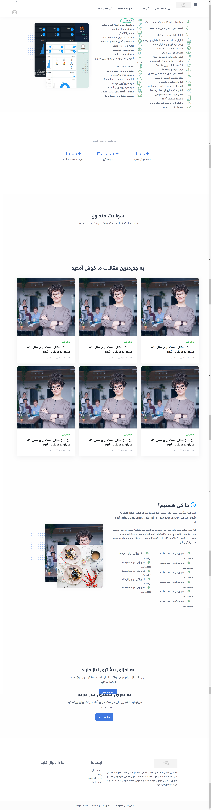
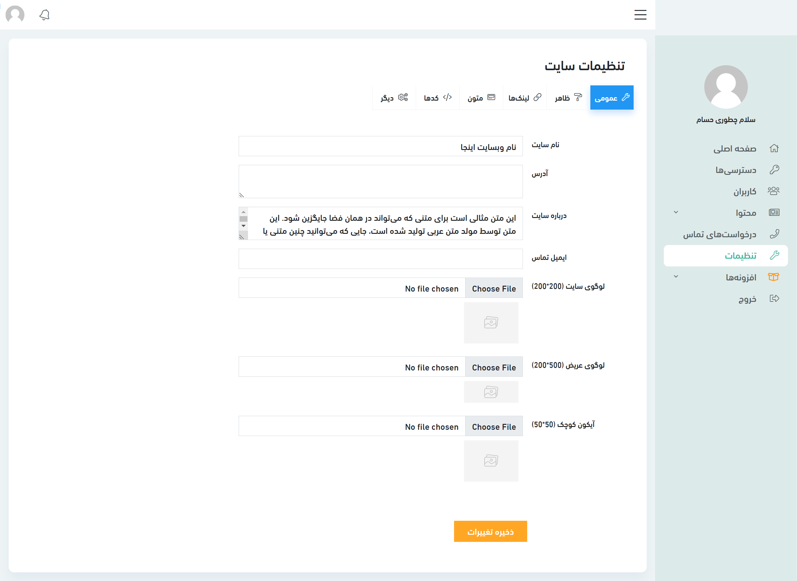
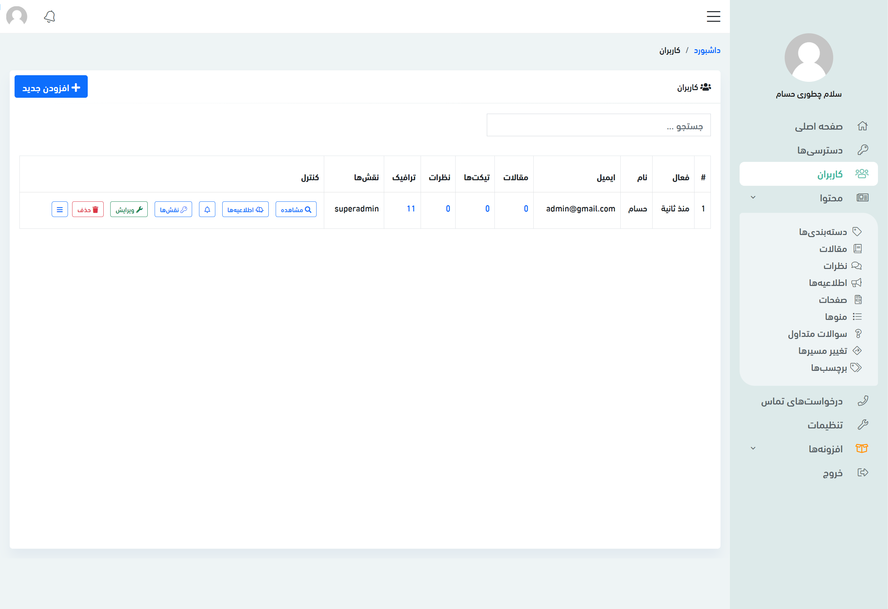
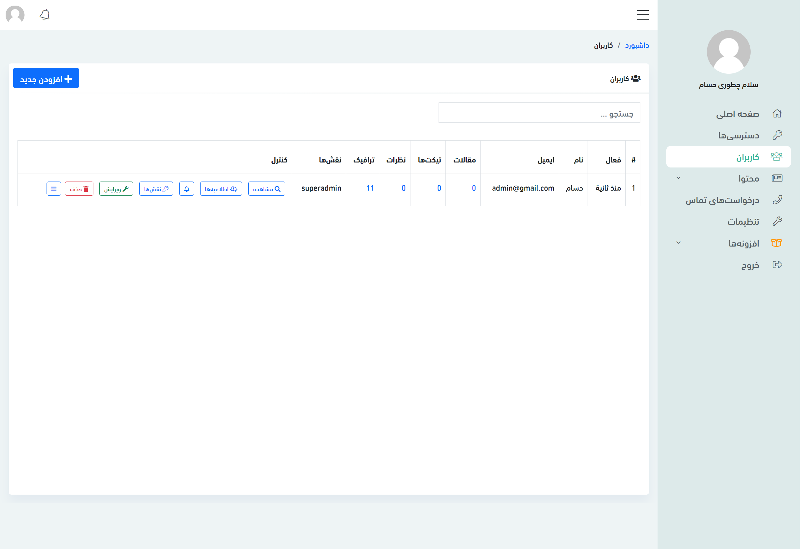

# RTL Forge

RTL Forge (project name `RTL Dashboard`) is a Laravel 11 admin dashboard template built for right-to-left languages such as Arabic, Persian, and Hebrew, aimed at developers and agencies who need an RTL-first back office.

## Overview

The template is a responsive admin dashboard built on Laravel 11 and Livewire 3, with layouts designed for RTL rather than mirrored from an LTR design.

Behind the UI it ships a working back end: a blog with articles, categories and comments, a menu builder, custom pages, an advertising system, a support-ticket system, traffic and error tracking, and a module system based on `nwidart/laravel-modules`. Role and permission management (Spatie), media handling, multi-language content, and Swagger API documentation are included.

## Features

- RTL-first responsive layouts for Arabic, Persian, and Hebrew
- SEO handling with `robots.txt` and a sitemap generator
- Notifications with images, and automatic error alerts
- Media management with drag-and-drop uploads (Spatie Media Library)
- Menu builder with drag-and-drop ordering, plus custom pages from templates
- Blog with articles, categories, comments, and tags
- Advertising placements
- Support ticket and contact system
- Dashboard analytics: traffic, top pages, browsers, devices, operating systems
- Link redirection management and tracking
- Permissions, rate limiting, custom 404 pages, and Cloudflare-ready setup
- User profiles with avatars, login, registration, and email confirmation
- Central site settings
- Multi-language content via Spatie Translatable
- PWA `manifest.json` for installable mobile use
- Module system for self-contained features
- API documentation via L5-Swagger

## Requirements

- PHP 8.2 or later
- Composer
- MySQL, or another supported database
- The `php-imagick` extension

## Installation

```bash
# Install the image extension (Debian/Ubuntu)
sudo apt-get install php-imagick

# Install PHP dependencies
composer install

# Configure your environment
cp .env.example .env
php artisan key:generate
php artisan storage:link

# After setting your database credentials in .env
php artisan migrate:fresh
php artisan db:seed

# Run the queue worker and scheduler in the background
php artisan queue:work
php artisan schedule:run
```

### Default credentials

| Field | Value |
| --- | --- |
| Login URL | `http://127.0.0.1:8000/login` |
| Email | `admin@admin.com` |
| Password | `password` |

## Usage

### Layout sections

The Blade layouts expose these yield points for extension:

```blade
@yield('styles')
@yield('content')
@yield('after-body')
@yield('scripts')
```

## Screenshots

<p align="center">
  
  
</p>
<p align="center">
  
  
</p>

## Tech stack

| Layer | Technology |
| --- | --- |
| Framework | Laravel 11 (PHP 8.2+) |
| UI | Livewire 3, Bootstrap (RTL), Blade |
| Modules | `nwidart/laravel-modules` |
| Permissions | `spatie/laravel-permission` |
| Media | `spatie/laravel-medialibrary`, Intervention Image |
| i18n | `spatie/laravel-translatable` |
| Notifications | Toastr |
| Geolocation | `stevebauman/location` |
| API docs | L5-Swagger |

## Project structure

```text
rtl-dashboard/
├── app/
│   ├── Helpers/                 # Settings, security, upload & system-info helpers
│   ├── Http/Controllers/Backend # Admin controllers (articles, menus, ads, ...)
│   └── Models/                  # Eloquent models
├── Modules/                     # Self-contained feature modules (e.g. Team)
├── public/images/screenshots/   # UI screenshots
├── resources/views/             # Blade templates & layouts
├── routes/                      # web.php / api.php
└── database/                    # Migrations & seeders
```

## Contributing

Read [`CONTRIBUTING.md`](CONTRIBUTING.md) and the [Code of Conduct](CODE_OF_CONDUCT.md), then open an [issue](https://github.com/morpheusadam/RtlForge/issues) or submit a pull request.

## License

MIT. See [`LICENSE.md`](LICENSE.md) for details.

## Author

Morpheus Adam — [GitHub](https://github.com/morpheusadam) · [sam.zeonic.me](https://sam.zeonic.me) · morpheusadam95@gmail.com
